# <center>sBlot Documentation
#### <center>January, 2023


## Table of contents
* 1. [Introduction](#introduction)
    * 1.1 [Maps](#map)
    	* 1.1.1 [Line map](#line)
    	* 1.1.2 [Dot map](#dot)
    	* 1.1.3 [Inverse Distance Weighting(IDW) map](#idw)
    	* 1.1.4 [Line and dot map](#linedot)
    * 1.2 [Weight plots](#weight)
    * 1.2 [Preference plots](#preference)
    * 1.3 [DIC plots](#DIC)
    * 1.4 [Pie plots](#pie)
* 2. [The config_plot.JSON file](#config)
    * 2.1 [How to load the results of an sBayes analysis?  How to save the plots?](#configresult)
    * 2.2 [How to include the original input data of an sBayes analysis?](#configdata)
    * 2.3 [How to customize the maps? ](#configmap)
    * 2.4 [How to customize the weight plots? ](#configweight)
    * 2.5 [How to customize the preference plots? ](#configpre)
    * 2.6 [How to customize the DIC plots?](#configdic)
    * 2.7 [How to customize the pie plots?](#configpie)
* 3. [Run sBlots](#python)
	* 3.1 [How to install Sblots?](#installation)
	* 3.2 [Draw a map](#pythonmap)
	* 3.3 [Draw a weight plot](#pythonweight)
	* 3.4 [Draw a preference plot](#pythonpre)
	* 3.5 [Draw a DIC plot](#pythondic)
	* 3.6 [Draw a pie plot](#pythonpie)


## 1 Introduction <a name="introduction"></a>

This document explains how to use sBlot - a software package designed to provide visualization functions for the package sBayes. Users can create five main types of plots with this package:

1. Maps 
2. Weight plots
3. Preference plots
4. DIC plots
5. Pie plots

Before plotting, users need to provide a config file (config_plot.JSON) where they define the plotting setup and specify the file path to the sBayes results ([Part 2.1](#configresult)) and the data used for analysis ([Part 2.2](#configdata)). More details about how to plot different types of figures are given below. 

### 1.1 Maps <a name="map"></a>
Maps show the posetrior distribution of clusters in geographic space. Maps can include

- the spatial location of the sites (e.g. languages) as points
- their assignment to clusters (e.g. contact areas) as colored dots, lines, or inverse distance weighted (IDW) interpolation, 
- their assignment to confunders (e.g. a language family) as colored polygons.

Users can also add different legend items, a basemap and an overview map (see example in **Figure 1**).

<center>
    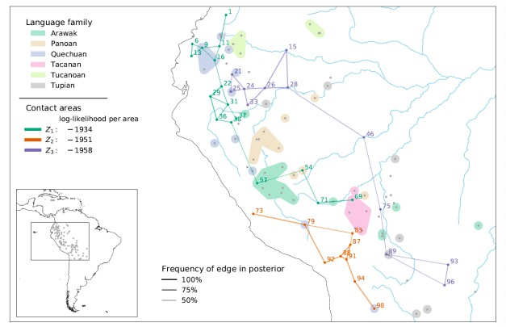
    <br>
    <div style="color:orange; border-bottom: 1px solid #d9d9d9;
    display: inline-block;
    color: black;
    padding: 2px;">Figure 1. A map with three contact areas (green, orange and purple dots and lines).</div>
</center>

	
[Part 2.3](#configmap) shows how to set-up the config plot file for generating maps. [Part 3.2](#pythonmap) shows how to execute the function to draw the maps.

#### 1.1.1 Line map <a name="line"></a>
The line map connects neighbouring sites belonging to the same cluster with a line. For language contact, these are neighbouring languages belonging to the same contact area. The line thickness indicates how often two sites are in the cluster together. **Figure 2** shows a line map for languages with 7 contact areas.
<center>
    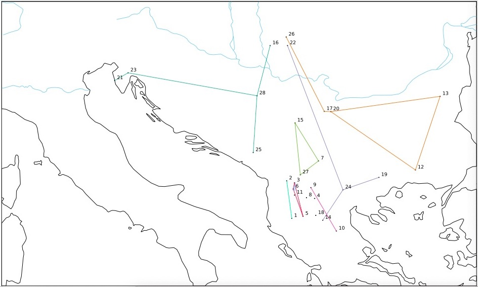
    <br>
    <div style="color:orange; border-bottom: 1px solid #d9d9d9;
    display: inline-block;
    color: black;
    padding: 2px;">Figure 2. Line graph with 7 contact areas</div>
</center>


#### 1.1.2 Dot map <a name="dot"></a>
In a dot map, sites in the same cluster have the same colour. Dot size indicates how often a site is in a cluster, e.g. how often a language is in a contact area. **Figure 3** shows a dot map with 7 contact areas.
<center>
    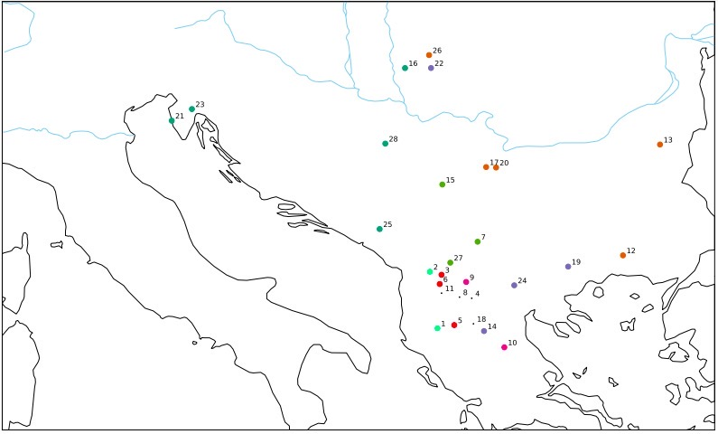
    <br>
    <div style="color:orange; border-bottom: 1px solid #d9d9d9;
    display: inline-block;
    color: black;
    padding: 2px;">Figure 3. Dot graph with 7 contact areas</div>
</center>


#### 1.1.3 Inverse Distance Weighting (IDW) map <a name="idw"></a>
The Inverse Distance Weighting (IDW)  produces a gradual spatial interpolation of clusters. Sites in a cluster are assigned a colour, which radiates to the surrounding space, so locations close to the cluster are similar in colour. **Figure 4** shows the IDW map for 7 contact areas.
<center>
    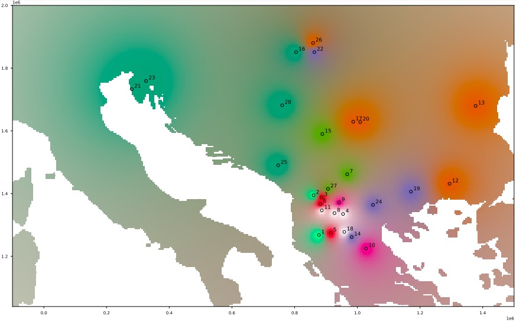
    <br>
    <div style="color:orange; border-bottom: 1px solid #d9d9d9;
    display: inline-block;
    color: black;
    padding: 2px;">Figure 4. IDW graph with 7 contact areas</div>
</center>


### 1.2 Weight plots <a name="weight"></a>
Weight plots visualize the posterior densities of the weights per feature: how well does each effect – the confounders and the clustering – predict the distribution of the feature in the data? For languages, there are two confounders - inheritance and universal preference - and contact, so the densities are displayed in a triangular probability simplex, where the left lower corner is the weight for contact (C), the right lower corner the weight for inheritance (I), and the upper corner the weight for universal preference (U). **Figure 6** shows the weight plot for the features F24 and F26. The distribution of F24 is best explained by inheritance and contact – both receive high posterior weights, but there is no single best explanation for F16 – the posterior weights are all over the place. The pink dot marks the mean of the distribution (optional). Again, sBayes returns the density plots for all features in a single grid.
<center>
    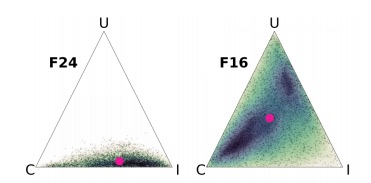
    <br>
    <div style="color:orange; border-bottom: 1px solid #d9d9d9;
    display: inline-block;
    color: black;
    padding: 2px;">Figure 5. Weight plots for two features (F24, F16)</div>
</center>

[Part 2.4](#configweight) shows how to set-up the config plot file for generating weight plots. [Part 3.3](#pythonweight) shows how to execute the function to draw the weight plots.

### 1.3 Preference plots <a name="preference"></a>
These plots visualize the preference for each of the states of a feature, either for each confounder or the clustering (for language these are the universal prefence, the preference in a family or a contact area). The appearance of the plot changes depending on the number of states: densities are displayed as ridge plots for two states (see **Figure 7**), in a triangular probability simplex for three states (similar to the weights, see previous section), a square for four states, a pentagon for five, and so on. sBayes returns the density plots for all features per confounder or for the clustering in a single grid. **Figure 7** shows the density plot for features F1, F2 with two states (N, Y) in an area. While the posterior distribution for F1 in the area is only weakly informative, with a slight tendency for Y, F2 clearly tends towards state N.
<center>
    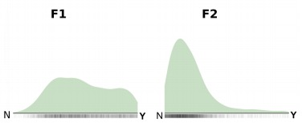
    <br>
    <div style="color:orange; border-bottom: 1px solid #d9d9d9;
    display: inline-block;
    color: black;
    padding: 2px;">Figure 6. The density plot shows the posterior preference for two features (F1, F2) in an area</div>
</center>

[Part 2.5](#configpre) shows how to set-up the config plot file for generating preference plots. [Part 3.4](#pythonpre) shows how to execute the function to draw the preference plots.

### 1.4 DIC plots <a name="DIC"></a>
The Deviance Information criterion (DIC) is a measure for the performance of a model, considering both model fit and model complexity. DIC plots visualize the DIC across several models, usually with increasing number of clusters, K, and help the analyst to decide for an appropriate number of clusters. As a rule of thumb, the best model is the one where the DIC levels off. **Figure 8** shows the DIC for seven models with increasing number of areas – K = 1 to K = 7. The DIC levels off for K = 2, suggesting two salient contact areas in the data. As the DIC plot compares performance across models, it needs several result files as input.
<center>
    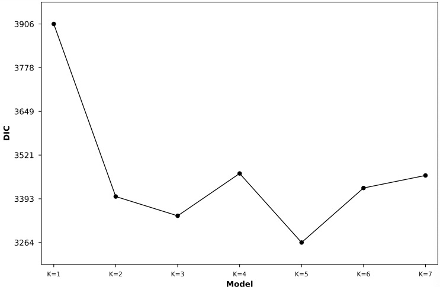
    <br>
    <div style="color:orange; border-bottom: 1px solid #d9d9d9;
    display: inline-block;
    color: black;
    padding: 2px;">Figure 7. DIC plot for models with increasing number of areas (K = 1 to K = 7)</div>
</center>
	
[Part 2.6](#configdic) shows how to set-up the config plot file for generating DIC plots [Part3.5](#pythondic) shows how to execute the function to draw the  DIC plots. 

### 1.5 Pie plots <a name="pie"></a>
The pie chart show how often each site was assigned to each cluster in the posterior (e.g. how often a language was assigned to each contact area).  **Figure 9** shows a  pie plots with 7 contact areas.
<center>
    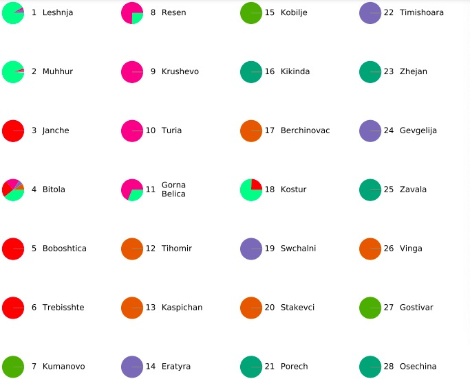
    <br>
    <div style="color:orange; border-bottom: 1px solid #d9d9d9;
    display: inline-block;
    color: black;
    padding: 2px;">Figure 8. Pie plot with 7 contact areas</div>
</center>
	
[Part 2.7](#configpie) shows how to set-up the config plot file for generating the pie plots [Part3.6](#pythonpie) shows how to execute the function to draw the pie plots. 

## 2 The config_plot.JSON file<a name="config"></a>

To customise plotting with sBlot, users can adjust the settings in the config\_plot.JSON file. The config_plot.JSON file has seven parts that can be modified:

- results: provides the file paths to the results of a sBayes analysis
- data: provides the file paths to the empirical data of the analysis
- map: provides parameters to plot the map
- weight\_plot: provides parameters to plot the weight\_plot
- preferece\_plot: provides parameters to plot the preference\_plot
- pie\_plot: provides parameters to plot the pie\_plot
- dic\_plot: provides parameters to plot the dic\_plot


### 2.1 How to load the results of an sBayes analysis?  How to save the plots?<a name="configresult"></a>
In config\_plot.JSON results, users can provide the paths to the results of a sBayes analysis (path\_in) and the file paths to the output folder where the plots are saved (path\_out). 
<br/>
<br/>
The path\_in has two sub-keys, areas for the posterior samples of the contact areas (area\*.txt), and stats for the posterior samples of the remaining parameters (stats\*.txt). As shown in the **Figure 10** and **Table 1**, users can provide several result files, which will be read in and plotted sequentially. The number of entries in areas and stats must be the same. The following code snippet reads the results of three runs in sBayes for which the number of areas, K, was iteratively increased from K = 1 to K = 3. Once the plots are generated, they are saved in the folder "plots".
<br/>
<br/>
The path\_out specifies the output path for different types of diagrams:
<br>* the path for the Maps
<br>* the path for Weight plots
<br>* the path for Preference plots
<br>* the path for DIC plots

<center>
    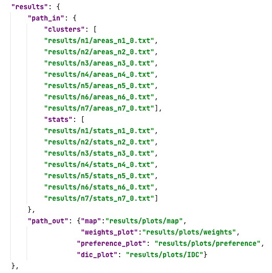<br>
<div style="color:orange; border-bottom: 1px solid #d9d9d9;
    display: inline-block;
    color: black;
    padding: 2px;">Figure . shows all keys in config_plot.JSON > results and gives default values and expected data types.</div>
</center>

<center>Table 1. The config_plot.JSON file: keys in results</center>

|Key| data type | default value | description
| -----------:| ---------|-----| ----|
| path_in | JSON  | - |file path to the results
| <font size=2>areas</font>| <font size=2>array</front>       | <font size=2>(required)<font> |<font size=2>file path to one or several areas\*.txt files</font>|
| <font size=2>stats</font>| <font size=2>array</front>       | <font size=2>(required)<font> |<font size=2> file path to one ore several stats\*.txt files</font>
| path_out   | string |required| file path to the output folder for saving the plots


### 2.2 How to include the original input data of an sBayes analysis?<a name="configdata"></a>

In the config\_plot.JSON: data part, the key data points to the empirical data which were used as an supporting input for the sBlot analysis. Users provide the file paths to the features.csv file (features), the applicable states for all features (feature\_states), and the coordinate reference system of the location data (projection). If no CRS is provided, sBlot assumes that the location data are latitude/longitude data in WGS84 ("epsg:4326"). The following JSON snippet tells plotting to open the file balkan\_features.csv, with applicable states in balkan\_features\_states.csv. Both files are located in the sub-folder data (relative to config_plot.JSON ). The location data are in ETRS89 Lambert Azimuthal Equal-Area projection ("epsg:3035").

<center>
    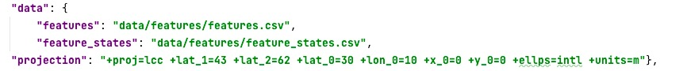
    <br>
    <div style="color:orange; border-bottom: 1px solid #d9d9d9;
    display: inline-block;
    color: black;
    padding: 2px;">Figure 11. shows all keys in config_plot.JSON > data and gives default values and expected data types.</div>
</center>

<center>Table 2: The config_plot.JSON file: keys in data
</center>

|Key| data type|default value| description
| -----------| ---------|-----| ----|
|features|string|(required)|path to the features.csv file| 
|feature_states| string|(required）|path to to the feature_states.csv file|
|projection|string|"epsg:4326"|CRS of the location data, as PROJ or EPSG|

### 2.3 How to customize the maps? <a name="configmap"></a>

The config_plot.JSON:map is to create a map of the posterior distribution of contact areas. Maps visualize the spatial locations of all languages, their assignment and interaction to contact areas, and, optionally, the language families. Users have a wide array of options to customize the map to their liking. They can change the content of the map (content), either visualizing the full posterior density or a consensus map. They can change the appearance of individual map items (graphic), tweak the projection and add base map items (geo). Finally, users can add a legend and an overview map (legend) and define the output format output. map has the following sub-keys, all of which are JSON objects.

- geo: adds a base map, changes the map extent and the map projection
- content: defines the map content
- graphic: changes the appearance of individual map items
- legend: adds a legend and/or an overview map
- output: defines the output format, size and resolution

#### 2.3.1 config_plot.JSON : map > geo

In geo, users can set the cartographic projection of the map, add base maps and define the map extent. In map\_projection users provide either a PROJ string or an EPSG code to define the coordinate reference system (CRS) of the map. If no CRS is provided, sBlot uses the CRS of the input data. In base\_map, users provide the file paths to polygon and line geometries which are displayed as base maps. base\_map has three sub\-keys: geojson\_polygon, which expects a file path to a GeoJSON polygon geometry, geojson\_line, which expects a file path to a GeoJSON line geometry, and add, which adds the base map when set to true and omits it if set to false (alternatively, the base\_map key can simply be left empty). Finally, in map\_extent
users give the map extent in the x-direction (x) and y-direction (y) in the CRS of the output map. If no extent is provided, the plotting function uses the bounding box of the data plus an offset as map extent. 
<br/>
<br/>
The following code snippet plots the map in the CRS of the World Geodetic System 1984, adds a land mask and a river network as a base map, and sets the map extent to cover Central Europe.
<center>
    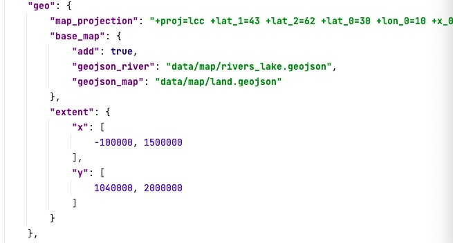
    <br>
    <div style="color:orange; border-bottom: 1px solid #d9d9d9;
    display: inline-block;
    color: black;
    padding: 2px;">Figure 12. summarises all keys in config_plot.JSON > map > geo and gives default values and
expected data types.</div>
</center>

<center>Table 3: The config_plot.JSON file: keys in map > geo
</center>

|<center>Key</center>| data type|default value| description
| -----------:| ---------|-----| ----|
|<center>map\_projection</center>|string|*|PROJ4 string or EPSG code to define a CRS| 
|<center>base_map</center>|JSON|-|Settings for the base map|
| <font size=2>add</font>| <font size=2>boolean</front>       | <font size=2>false<font> |<font size=2> File path to GeoJSON polygon geometrys</font>|
| <font size=2>geojson_<br>polygon</font>| <font size=2>array</front>| <font size=2>-<font> |<font size=2> File path to GeoJSON line geometry</font>|
| <font size=2>geojson\_<br>line</font>| <font size=2>array</front>       | <font size=2>-<font> |<font size=2>file path to one or several areas\*.txt files</font>|
|<center>extent</center>|JSON|-|Defines the map extent|
|<font size=2>x</font>| <font size=2>array</front>| <font size=2>\*<font> |<font size=2> Range of the extent in x\-direction</font>|
|<font size=2>y</font>| <font size=2>array</front>| <font size=2>\*<font> |<font size=2>Range of the extent in y\-direction</font>|


#### 2.3.2 config_plot.JSON :  map > content
The key content defines the map type and all map items. There are two different map types (type): users can either visualize the full posterior density of all contact areas ("density\_map") , a high-level summary of the posterior, the consensus areas ("consensus\_map"), or the Inverse Distance Weighting("idw\_map"). The density map shows all languages that are in the posterior. Line width indicates how often two languages appear together in the same area in the posterior. For consensus areas, the map is generalized. "min\_posterior\_frequency" defines the degree of generalization. For example, a "min\_posterior\_frequency" of 1 retains only those language which are in all posterior contact areas, while a value of 0.3 retains languages which appear in at least 30% of the posterior, preserving more of the posterior uncertainty. After generalization, all remaining languages are connected with a Gabriel graph.With plot\_families users can visualize the language families, burn_in specifies which part of the posterior is discarded as burn-in.
<br/>
<br/>
The following code snippet creates a consensus map showing languages which are at least in 90% of the posterior contact areas. The map don't visualizes language families and uses a shorthand labels the languages. The first 20% of all samples are discarded as burn-in.

<center>
    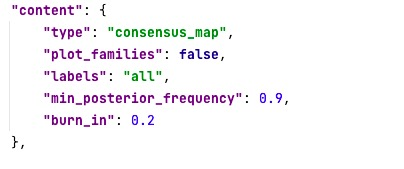
    <br>
    <div style="color:orange; border-bottom: 1px solid #d9d9d9;
    display: inline-block;
    color: black;
    padding: 2px;">Figure 13. shows all keys in config_plot.JSON > map > content and gives default values and expected data types</div>
</center>

<center>Table 4: The config_plot.JSON file: keys in map > content
</center>

|Key| data type|default value| description
|:-----------:|:---------:|:-----:|:----:|
|type|string|consensus_map| type of plot, "density\_map", "consensus\_map",or "idw\_map"| 
|plot_families|boolean|false| Plot the language families?|
|label|string|all| add the language lable? |
|min\_posterior<br>\_frequency| number|0.9|degree of generalization (only for consensus maps)|
|burn_in|number|0.2| fraction of posterior samples discarded as burn-in|


#### 2.3.3 config_plot.JSON : map > graphic
In graphic, users can change the appearance of the individual map items, including the languages (languages), the posterior areas (clusters), the families (families) and the base map(base\_map). Alternatively, users can leave all parameters untouched, in which case the default design is used. The key (languages) tunes how the languages are displayed on the map: the sub\-key size changes the size of the point markers, color changes their color, and (labels) adds labels. For reasons of readability, on the map labels are shown as numeric shorthand notations, for which users can output a correspondence table (see key (output)). The (clusters) key has four sub-keys: users can change the size of the point markers (point\_size), set the color of each contact area (color), and change the width（line\_width) and the transparency (alpha) of the lines connecting the languages in an area. In families, users can change the color and the shape of the family polygons. For a small shape value, each language is assigned to their own circular polygon. Users can set the size of this polygon (size). When the shape value is increased,
the family polygons are more and more generalized, such that neighbouring languages from the same family are aggregated to larger polygons using alpha shapes. These polygons have a buffer (in map units). For good results without overlapping polygons expect to tweak the shape and the buffer values iteratively. The key base\_map defines the appearance of the base map polygons (polygon – with sub-keys color, outline\_color, and outline\_width, and the
base map lines (line – with sub-keys color and width). 

<br\>
The following code snippet creates a map combinng line and dot graph. The thickness of the line show the frequency of two languages gather together, and the size of dot shows the frequency of languages in an area 


<center>
<figure class="half">
    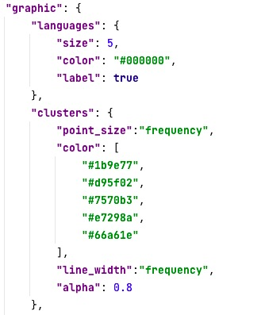
    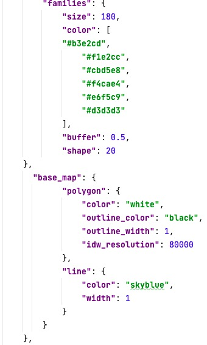 </figure>
    <br>
    <div style="color:orange; border-bottom: 1px solid #d9d9d9;
    display: inline-block;
    color: black;
    padding: 2px;">Figure 14. summarises all keys in config_plot.JSON > map > graphic and gives default values and expected data types.</div>
</center>


<center>Table 5: The config_plot.JSON file: keys in map > graphic
</center>

|<center>Key</center>| data type|default value| description
| -----------:| ---------|-----| ----|
|<center>language</center>|JSON|-|appearance of languages on the map|
| <font size=2>size</font>| <font size=2>number</front>| <font size=2>5<font> |<font size=2> size of the point markers for languages</font>|
| <font size=2>color</font>| <font size=2>string</front>| <font size=2>"#000000" <font> |<font size=2>color of the point marker for languages</font>| 
| <font size=2>label</font>| <font size=2>boolean</front>| <font size=2>true<font>|<font size=2> Add labels for the languages</font>|
|<center>clusters</center>|JSON|-| appearance of areas on the map|
| <font size=2>point\_<br>size</font>| <font size=2>number or string </front>| <font size=2>"frequency"<font> |<font size=2> size of the point markers for languages in an area.It can be fixed number or the frequency of one langauges.</font>|
| <font size=2>color</font>| <font size=2>array</front>| <font size=2>\*<font> |<font size=2> color of each contact area</font>| 
| <font size=2>line\_<br>width</font>| <font size=2>number or string</front>| <font size=2>"frequency"<font> |<font size=2> width of the line between languages in an area. It can be fixed number or the frequency of langauges.</font>|
| <font size=2>alpha</font>| <font size=2>number</front>| <font size=2>0.5<font> |<font size=2> transparency of the line between languages in an areaa</font>|
|<center>families</center>|JSON|-| appearance of the families on the map|
| <font size=2>size</font>| <font size=2>number</front>| <font size=2>180<font> |<font size=2> size of a single language polygon</font>|
| <font size=2>color</font>| <font size=2>array</front>| <font size=2>\*<font> |<font size=2> color of each family</font>| 
| <font size=2>buffer</font>| <font size=2>array</front>| <font size=2>0.5<font> |<font size=2> buffer around the generalized language polygons</font>|
| <font size=2>shape</font>| <font size=2>array</front>| <font size=2>20 <font> |<font size=2> defines the level of generalization for family polygons</font>|
|<center>base\_map</center>|JSON|-|appearance of the base map|
|<font size=2>polygon</font>| <font size=2>JSON</front>| <font size=2>-<font> |<font size=2> the appearance of the polygon geometries</font>|
| <font size=1>color</font>| <font size=1>string</front>| <font size=1>"white"<font>|<font size=1> face color of the polygons</font>| 
| <font size=1>outline<br>\_color</font>| <font size=1>string</front>| <font size=1>"black"<font> |<font size=1> outline color of the polygons</font>|
| <font size=1>outline<br>\_width</font>| <font size=1>number</front>| <font size=1>0.5<font> |<font size=1> outline width of the polygons</font>|
|<font size=2>line</font>| <font size=2>JSON</front>| <font size=2>-<font> |<font size=2> the appearance of the line geometries</font>|
| <font size=1>color</font>| <font size=1>string</front>| <font size=1>"skyblue"<font>|<font size=1>color of the lines</font>| 
| <font size=1>width</font>| <font size=1>number</front>| <font size=1>1<font>|<font size=1>width of the lines</font>|


#### 2.3.4 config_plot.JSON : map > legend

In legend, users can add legend items to the map or remove them. When no legend item is provided the default legend is used. There a five legend items: a legend for the posterior contact areas (clusters), a legend for the lines in a contact area (lines), a legend for the families (families), a correspondence table (correspondence) and an overview map (overview). For each of these, users can decide whether or not to add the item (add) and where to place it on the map canvas (position) (except for the correspondence table will always be placed below the map). The position is given for the lower-left corner of the legend item relative to the lower-left corner of the image and the map extant. For example, [0.1, 0.3] means that the legend item is located 10% of the map width to the right and 30% of the map height up, relative to the lower-left corner of the map. 
<br/>
<br/>
The clusters legend lists all contact areas and ranks them according to the relative posterior probability. The lines legend helps interpreting line thickness in the map (the thicker the line the more often two languages appear together in the same area).  The families legend explains the families on the map. The legend can only be added when families are shown. The correspondence table links the labels in numeric short hand notation on the map to the names of the actual languages. Entries in the correspondence table can be colored to match the colors of the contact areas (color_labels). Coloring is only available for consensus maps. Moreover, users can change the number ofcolumns (n_columns) in the correspondence table, the  font size for the entries (font_size) and the height of the table (table_height). Finally, overview adds an overview map. Users can set the extent(extent) in x-direction (x) and y-direction (y) and give the size of the overview image on the map in centimetres (height, (width).
<br/>
<br/>
The following code snippet adds a legend item for clusters and changes its position on the map. The code also adds a legend item for lines. Finally, it removes the legend item for families. It adds a correspondence table with colored entries and a 3x3 cm overview map of (roughly) Europe

<center>
<figure class="half">
    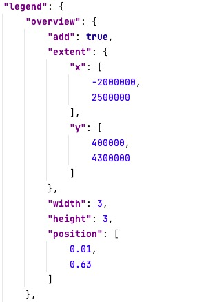
     
    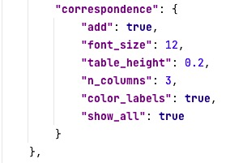 
    </figure>
    <br>
    <div style="color:orange; border-bottom: 1px solid #d9d9d9;
    display: inline-block;
    color: black;
    padding: 2px;">Figure 15. summarises all keys in config_plot.JSON > map > legend and gives default values and expected data types.</div>
</center>


<center>Table 6: The config_plot.JSON file: keys in map > legend
</center>

|<center>Key</center>| data type|default value| description
| -----------:| ---------|-----| ----|
|<center>overview</center>|JSON|-|overview map|
| <font size=2>add</font>| <font size=2>boolean</front>| <font size=2>false<font> |<font size=2>add the overview map?</font>|
| <font size=2>extent</font>| <font size=2>JSON</front>| <font size=2>-<font> |<font size=2>  extent of the overview map</font>| 
| <font size=1>x</font>|<font size=1>array</front>| <font size=1>\*<font> |<font size=1>  range of the extent in x-direction</font>|
| <font size=1>y</font>| <font size=1>array</front>| <font size=1>*<font> |<font size=1>  range of the extent in y-direction</font>|
| <font size=2>width</font>| <font size=2>number</front>| <font size=2>3<font>|<font size=2> width of the overview map (in cm)</font>|
|<font size=2>height</font>| <font size=2>number</front>| <font size=2>3<font> |<font size=2> height of the overview map (in cm)</font>|
| <font size=2>position</font>| <font size=2>array</front>| <font size=2>[0.01,0.63]<font> |<font size=2>  relative position of the overview map</font>| 
|<center>cluster</center>|JSON|-| legend for cluster|
| <font size=2>add</font>| <font size=2>boolean</front>| <font size=2>false<font> |<font size=2> add legend entry for cluster?</font>|
| <font size=2>position</font>| <font size=2>array</front>| <font size=2>[0.005,0.75]<font> |<font size=2>relative position of the  cluster legend entry</font>|
|<center>lines</center>|JSON|-| legend for lines|
| <font size=2>add</font>| <font size=2>boolean</front>| <font size=2>false<font> |<font size=2>  add legend entry for lines?</font>|
| <font size=2>position</font>| <font size=2>array</front>| <font size=2>[0.005,0.53]<font> |<font size=2> relative position of the legend entry</font>|
|<center>familes</center>|JSON|-| legend for language famalies|
| <font size=2>add</font>| <font size=2>boolean</front>| <font size=2>false<font> |<font size=2>  add legend entry for families?</font>|
| <font size=2>position</font>| <font size=2>array</front>| <font size=2>[0.005,0.30]<font> |<font size=2> relative position of the legend entry</font>|
|<center>correspondence</center>|JSON|-| the correspondence table|
| <font size=2>add</font>| <font size=2>boolean</front>| <font size=2>false<font> |<font size=2> add correspondence table</font>|
| <font size=2>font_size</font>| <font size=2>number</front>| <font size=2>12<font> |<font size=2> font size in the correspondence table</font>|
| <font size=2>table_height</font>| <font size=2>number</front>| <font size=2>0.2<font> |<font size=2>  height of the correspondence table</font>|
| <font size=2>n_columns</font>| <font size=2>number</front>| <font size=2>3<font> |<font size=2> number of columns in the correspondence table</font>|
| <font size=2>color_labels</font>| <font size=2>boolean</front>| <font size=2>true<font> |<font size=2>  color the labels in the table to match contact areas?</font>|
| <font size=2>show_all</font>| <font size=2>boolean</front>| <font size=2>true<font> |<font size=2> add the names of all languages in correspondence table?|


#### 2.3.5 config_plot.JSON : map > output
In output, users define the width and the height of the output figure, its file format and resolution. The following code snippet creates a figure of size 14x10cm in pdf-format with a resolution of 400 pixels per inch.

<center>
    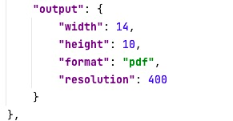
    <br>
    <div style="color:orange; border-bottom: 1px solid #d9d9d9;
    display: inline-block;
    color: black;
    padding: 2px;">Figure 16. shows all keys in config_plot.JSON > map > output and gives default values and expected data types</div>
</center>


Table 7: The config_plot.JSON file: keys in map > output

|<center>Key</center>| data type|default value| description
| -----------| ---------|-----| ----|
|width|number|14| width of the output figure in cm|
|height|number|10| height of the output figure in cm|
|format|string|"pdf"|file format of the output figure|
|resolution|resolution|300|resolution of the output figure in pixels per inch|

### 2.4 How to customize the weight plots ?<a name="configwieght"></a>
Weight plots visualize the posterior densities of the weights per feature: how well does each of the effects – universal preference, inheritance and contact – explain the distribution of the feature in the data? The densities are displayed in a triangular probability simplex, where the left lower corner is the weight for contact, the right lower corner the weight for inheritance, and the upper corner the weight for universal preference. The weight plots of several features are combined into one overall figure. There are three subkeys in the config_plot.JSON: weight\_plots part: content, graphic,and output.
####2.4.1 config_plot.JSON : weight\_plot > content
In content, users specify for which of the features the weights are plotted (features). Users pass the relevant features in an array. For example, [3] generates a weight plot for feature three only; [3, 4, 17] generates weight plots for features three, four and seventeen. When the array is left empty or features are not provided explicitly, the plotting function generates weight plots for all features. Moreover, users can specify in burn_in which part of the posterior to discard as burn-in. 
<br/>
<br/>
The following code snippet creates weight plots for features 5,6, and 8. The first 20% of the posterior samples are discarded as burn-in.

<center>
    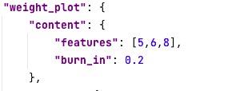
    <br>
    <div style="color:orange; border-bottom: 1px solid #d9d9d9;
    display: inline-block;
    color: black;
    padding: 2px;">Figure 17. shows all keys in config\_plot.JSON > weight\_plot > content and gives default values and expected data types</div>
</center>

Table 8: The config\_plot.JSON file: keys in weight\_plot > content

|Key| data type|default value| description
| -----------| ---------|-----| ----|
|features|array|\[\]| features for which weight plots area created|
|burn_in|number|0.2|fraction of the posterior samples discarded as burn-in|


####2.4.2 config_plot.JSON : weight\_plot > legend
In graphic, users can label of each of the corners in the triangular probability simplex labels. The default labels are ["U", "C", "I"]. The sub-key title adds the feature name as a title for each weight plot. Moreover, users can specify how the sub-plots for single features are combined
in the overall figure: n_columns gives the number of columns in the overall figure. 
<br/>
<br/>
The following code snippet uses alternative labels and title for each sub-plot. 

<center>
    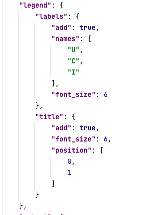
    <br>
    <div style="color:orange; border-bottom: 1px solid #d9d9d9;
    display: inline-block;
    color: black;
    padding: 2px;">Figure 18. shows all keys in config\_plot.JSON > weight\_plot > legend and gives default values and expected data types</div>
</center>

Table 9: The config\_plot.JSON file: keys in weight\_plot > content

|Key| data type|default value| description
| -----------:| ---------|-----| ----|
|<center>labels</center>|JSON|-| labels for the corners of the probability simplex|
|<font size=2><center>add</center></font>|<font size=2>boolean</font>|<font size=2>ture</font>| <font size=2>whether to add the label</font>|
|<font size=2>names</font>|<font size=2>array</font>| <font size=2>["U","C","I"]</font>| <font size=2> labels for the corners of the probability simplex</font>|
|<font size=2>font\_<br>size</font>|<font size=2>number</font>| <font size=2>6</font>| <font size=2> the font size fot the labels</font>|
|<center>title</center>|JSON|-| Use the feature name as a title for each sub-plot?|
|<font size=2>add</font>|<font size=2>boolean</font>|<font size=2>ture</font>| <font size=2>whether to add the title</font>|
|<font size=2>font\_<br>size</font>|<font size= > number</font>| <font size=2> 6 </font>| <font size=2>font size for the title</font>|
|<font size=2>position</font>|<font size=2>array</font>| <font size=2>[0,1]</font>| <font size=2> position for the title</font>|


####2.4.3 config_plot.JSON : weight\_plot > output

In output, users define the width and the height of each of the sub-plots (width/_subplot, height/_subplot, the file format of the output file and the resolution, n/_columns). 
<br/>
<br/>
The following code snippet creates 2x2 cm sub-plots. All sub-plots are combined in an overall figure and saved in pdf-format with a resolution of 300 pixels per inch. All sub-plots are combined in an overall figure with five columns.

<center>
    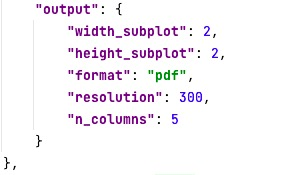
    <br>
    <div style="color:orange; border-bottom: 1px solid #d9d9d9;
    display: inline-block;
    color: black;
    padding: 2px;">Figure 19. shows all keys in config\_plot.JSON > weight\_plot > output and gives default values and expected data types</div>
</center>


Table 10: The config\_plot.JSON file: keys in weight/_plot > output

|Key| data type|default value| description
| -----------| ---------|-----| ----|
|width_subplot|number|2|width of each subplot in cm|
|height_subplot|number|2|height of each subplot in cm|
|format|string|"pdf"|file format of the output figure|
|resolution|resolution|300|resolution of the output figure in pixels per inch|
|n_columns|number|5| number of columns in the overall plot|

### 2.5 How to customize the preference plot?<a name="configpre"></a>
The Preference plots visualize the posterior preference for each of the states of a feature, either universally, in a family or in a contact area. The appearance of the plot changes depending on the number of states: densities are displayed as ridge plots for two states (see **Figure 7**), , in
a triangular probability simplex for three states, a square for four states, a pentagon for five,and so on. preference_plot combines the sub-plot for several features (per family, per area or globally) in a single figure

####2.5.1 config_plot.JSON : preference\_plot > content
In content, users specify for which of the features preferences are plotted. Users pass the relevant features in an array. For example, [3] generates preference plots for feature three only; [3, 4, 17] generates preference plots for features three, four and seventeen. When the array is left empty or features are not provided explicitly, the plotting function generates plots for all features. Moreover, users can define which preference to plot, i.e. preference in one of the areas, in one of the families, or universal preference. For example, ["universal", "area\_1", "Arawak"] creates three plots: a plot for universal preference, for preference in area 1, and for preference in the Arawakan family. General, all sub-plots for one preference are combined in a single figure. When preference is not provided explicitly, preference plots are generated for all the areas as default. Finally, users can specify in burn\_in which part of the posterior to discard as burn-in.
<br/>
<br/>
The following code snippet creates sub-plots for features 7, 8, and 9 and preference in areas 2 and 3. The first 20% of the posterior samples are discarded as burn-in.


<center>
    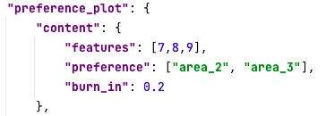
    <br>
    <div style="color:orange; border-bottom: 1px solid #d9d9d9;
    display: inline-block;
    color: black;
    padding: 2px;">Figure 20. shows all keys in config\_plot.JSON > preference\_plot > content and gives default values and expected data types</div>
</center>

Table 11: The config\_plot.JSON file: keys in preference\_plot > content

|Key| data type|default value| description
| -----------| ---------|-----| ----|
|features|array|\[\]| features for which preference plots area created|
|preference|array|all areas|preference (area, family, global) for which plots area created|
|burn_in|number|0.2| fraction of the posterior samples discarded as burn-in|


####2.5.2 config_plot.JSON : preference\_plot > legend

In legend, users can change the appearance of the preference plot. Specifically, they can use the state names of the features to label both ends of the ridge, or the corners of the probability simplex in case there are more than two states (labels). The sub-key title adds the feature name as a title for each preference plot. Moreover, users can specify how the sub-plots for single features are combined in the overall figure. 
<br/>
<br/>
The following code snippet uses the state names as labels and the features names as a title for each sub-plot. Sub-plots are combined in overall figures.

<center>
    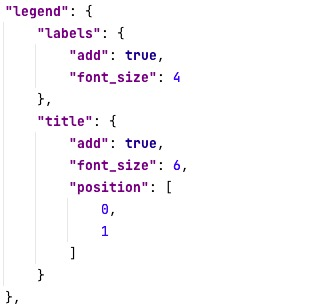
    <br>
    <div style="color:orange; border-bottom: 1px solid #d9d9d9;
    display: inline-block;
    color: black;
    padding: 2px;">Figure 21. shows all keys in config\_plot.JSON > preference\_plot > legend and gives default values and expected data types</div>
</center>

Table 12:  The config\_plot.JSON file: keys in preference_plot > legend

|Key| data type|default value| description
| -----------:| ---------|-----| ----|
|<center>labels</center>|JSON|-| labels for the corners of the probability simplex|
|<font size=2><center>add</center></font>|<font size=2>boolean</font>|<font size=2>ture</font>| <font size=2>whether to add the label</font>|
|<font size=2>font\_<br>size</font>|<font size=2>number</font>| <font size=2>4</font>| <font size=2>font size for the labels</font>|
|<center>title</center>|JSON|-| Use the feature name as a title for each sub-plot?|
|<font size=2>add</font>|<font size=2>boolean</font>|<font size=2>ture</font>| <font size=2>whether to add the title</font>|
|<font size=2>font\_<br>size</font>|<font size=2>number</font>| <font size=2>6 </font>| <font size=2>font size for the title</font>|
|<font size=2>position</font>|<font size=2>array</font>| <font size=2>[0,1]</font>| <font size=2> position for the title</font>|
####2.5.3 config_plot.JSON : preference\_plot > output
In output, users define the width and the height of each of the sub-plots (width\_subplot, height\_subplot, the file format of the output file, the resolution, and n\_columns). n\_columns gives the number of columns in the overall figure.
<br/>
<br/>
The following code snippet creates 3x3 cm sub-plots. All sub-plots are combined in an overall figure and saved in pdf-format with a resolution of 300 pixels per inch with 5 columns.

<center>
    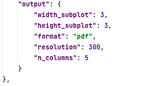
    <br>
    <div style="color:orange; border-bottom: 1px solid #d9d9d9;
    display: inline-block;
    color: black;
    padding: 2px;">Figure 22. shows all keys in config\_plot.JSON > preference\_plot > output and gives default values and expected data types</div>
</center>

Table 13: The config_plot.JSON file: keys in preference\_plot > output

|Key| data type|default value| description
| -----------| ---------|-----| ----|
|width_subplot|number|3|width of each subplot in cm|
|height_subplot|number|3|height of each subplot in cm|
|format|string|"pdf"|file format of the output figure|
|resolution|resolution|300|resolution of the output figure in pixels per inch|
|n_columns|number|5| number of columns in the overall plot|


### 2.6 How to customize the DIC plots? <a name="configdic"></a>
The Deviance Information criterion (DIC) is a measure for the performance of a model, considering both model fit and model complexity. DIC plots visualize the DIC across several models,
usually with increasing number of areas, K. Plotting the DIC is only meaningful when several areas*.txt and stats*.txt files from different models are provided in results.

####2.6.1 config\_plot.JSON : dic\_plot > content
In content, users can change which models appear in the DIC and how they are ordered (models). Typically, models are ordered from simplest to most complex, e.g. from fewest to most areas. When no models are provided by the user, the DIC is plotted for all models from results. Moreover, users can specify in burn_in which part of the posterior to discard as burn-in.
<br/>
<br/>
Codes in **Figure 23** snippet creates a DIC plot for models 1, 3, and 5 in results. The first 40% of the posterior samples of each model are discarded as burn-in.

Table 14: The config\_plot.JSON file: keys in dic\_plot > content

|Key| data type|default value| description
| -----------| ---------|-----| ----|
|burn_in|number|0.4| fraction of the posterior samples discarded as burn-in|
|models|array| all models |models that appear in the DIC plot|

####2.6.2 config_plot.JSON : dic\_plot > graphic
In graphic, users can change the appearance of the DIC plot. Specifically, they can label the models in the plot (labels) and change whether consecutive DIC values are connected with a line (line_plot) or a scatter plot is used. As a default, the models are labelled in ascending order, starting from 1. 
<br/>
<br/>
Codes in **Figure 23** uses the labels "K=1" to "K=7". Consecutive DIC values are vconnected with a line.

Table 15: The config\_plot.JSON file: keys in dic_plot > content

|Key| data type|default value| description
| -----------| ---------|-----| ----|
|labels|array|\*| labels of the models|
|lline_plot|boolean|true| Connect consecutive DIC values with a line? |

####2.6.3 config_plot.JSON : dic\_plot > output
In output, users define the width and the height of the DIC plot (width, height, the file format of the output file and the resolution)
<br/>
<br/>
The following code snippet creates a 15x15 cm DIC plot in pdf-format with a resolution of 300 pixels per inch.

Table 16: : The config\_plot.JSON file: keys in dic_plot > output

|Key| data type|default value| description
| -----------| ---------|-----| ----|
|width|number|15| width of the plot in cm|
|height|number|15|  height of the plot in cm|
|format|string|"pdf"|file format of the output figure|
|resolution|resolution|300|resolution of the output figure in pixels per inch|

<br>
<br>
<center>
    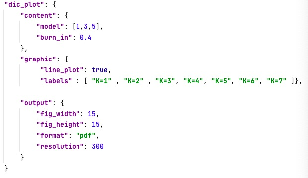
    <br>
    <div style="color:orange; border-bottom: 1px solid #d9d9d9;
    display: inline-block;
    color: black;
    padding: 2px;">Figure 23. shows all keys in config\_plot.JSON > dic\_plot  and gives default values and expected data types</div>
</center>

### 2.7 How to customize the pie plots?  <a name="configpie"></a>
The Pie plot is to show the weights of each area for a language. The config\_plot.JSON: pie\_plot has the following sub-keys: content and output.

####2.7.1 config_plot.JSON : pie\_plot > content

In content, users can specify in burn_in which part of the posterior to discardas burn-in

Table 17: The config_plot.JSON file: keys in pie\_plot > content

|Key| data type|default value| description
| -----------| ---------|-----| ----|
|burn_in|number|0.2| fraction of the posterior samples discarded as burn-in|

####2.7.2 config_plot.JSON : pie\_plot > output
In output, users define the width and the height of the pie plot (width, height, spacing\_horizontal,spacing\_vertical,the fileformat of the output file and the resolution.) 
<br/>
<br/>
The following code snippet creates 4*2cm sub-plots in pdf-format with a resolution of 300 pixels per inch. All sub-plots are combined in an overall
figure.

<center>
    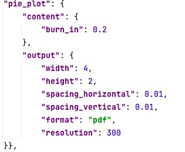
    <br>
    <div style="color:orange; border-bottom: 1px solid #d9d9d9;
    display: inline-block;
    color: black;
    padding: 2px;">Figure 24. shows all keys in config\_plot.JSON > pie\_plot  and gives default values and expected data types</div>
</center>

Table 18: The config_plot.JSON file: keys in pie\_plot > content

|Key| data type|default value| description
| -----------| ---------|-----| ----|
|width|number|4| width of the pie plot in cm|
|height|number|2|height of the pie plot in cm|
|spacing_horizontal|number|0.01| Horizontal distance between two pie charts|
|spacing_vertical|number|0.01|vertical distance between two pie charts|
|format|string|"pdf"| file format of the output figure|
|ressolution|number|300|resolution of the output figure in pixels per inch|


## 3 Run sBlot <a name="python"></a> 
To run sBlots, you need Python (version >=3.7) and three required system libraries: GEOS, GDAL, PROJ. The way of installing these system requirements depends on your operating system.  It can be used as a python library or through a command line interface. 

### 3.1 [How to install SBlot]<a name="installation"></a>
To run sBlot, you need Python (version >=3.7) and three required system libraries: GEOS, GDAL, PROJ.Then you can install sBlot. The exact steps to do this depend on your operating system (due to different ways of installing dependencies). Following are the instructions for Linux, MacOS and Windows.
#### 3.1.1 Linux (Debian/Ubuntu)
To install sBlot, open a terminal window, navigate to the folder where you want to install it
and follow these steps:
1. Get the sBlot source code by running git clone https://github.com/derpetermann/sBayes.
This will create a sBayes directory on your computer.
2. Navigate to this new directory by running cd sBlot.
3. Install GEOS, GDAL and PROJ by running sudo apt-get install -y libproj-dev proj-data proj-bin li4. Install sBayes along with some required python libraries by running pip install .
#### 3.1.2 MacOS
On MacOS, we recommend using homebrew to install the required system packages. Open a terminal window, navigate to the folder where you want to install sBlot and follow these
steps:
1. Get the sBlot source code by running git clone https://github.com/derpetermann/sBayes.This will create a sBlot directory on your computer.
2. Navigate to this new directory by running cd sBlot.
3. Install GEOS, GDAL and PROJ by running brew install proj geos gdal
4. Install sBlot along with some required python libraries by running pip install .
#### 3.1.3 Windows
On Windows, we recommend using https://www.anaconda.com/Anaconda to install the required packages. To do this, download Anaconda from https://www.anaconda.com/, open an Anaconda terminal window, navigate to the folder where you want to install sBlot and follow these steps:
1. Get the sBlot source code by running git clone https://github.com/derpetermann/sBlot.
This will create a sBayes directory on your computer.
2. Navigate to this new directory by running cd sBlot.
3. Install GEOS, GDAL and PROJ manually or using the OSGeo4W installer https://trac.osgeo.org/osgeo4w.
4. Install sBayes along with some required python libraries by running pip install . 

### 3.2 [codes for drawing map]<a name="pythonmap"></a>

- `posterior_map(results: Results, file_name:PathLike)`: plotting the line and dot map.
   > Argument:
       <br/> &nbsp; &nbsp;&nbsp;&nbsp;&nbsp;results:the result of Sbayes
       <br/> &nbsp; &nbsp;&nbsp;&nbsp;&nbsp;file_name: a path of the output file.
  
- `get_idw_map(results: Results, file_name:String)`:plotting idw map.

 > Argument:
       <br/> &nbsp; &nbsp;&nbsp;&nbsp;&nbsp;results:the result of Sbayes
       <br/> &nbsp; &nbsp;&nbsp;&nbsp;&nbsp;file_name: file name.

```
  #### How to run the posterior_map in python? ####
plot = Plot()
plot.load_config(config_file='config_plot.json')
plot.read_data()

for name, result in plot.iterate_over_models():      
	plot.posterior_map(results=result, file_name=f'map_{name}')
	plot.get_idw_map(result,name)
   
  #### How to run the posterior_map from command line?####
# open SBlot and draw map
cd SBlot
python plot.py config_plot.json map

```

### 3.3 [Codes for drawing Weight plot]<a name="pythonweight"></a>

- `plot_weights(results: Results, file_name:PathLike)`: plotting the line and dot map.

  > Argument:
       <br/> &nbsp; &nbsp;&nbsp;&nbsp;&nbsp;results:the result of Sbayes
       <br/> &nbsp; &nbsp;&nbsp;&nbsp;&nbsp;file_name: a path of the output file.
       
```
     #### How to run the posterior_map in python? ####
plot = Plot()
plot.load_config(config_file='config_plot.json')
plot.read_data()

for name, result in plot.iterate_over_models():      
	plot.plot_weights(results, file_name='weights_grid_' + name)

  #### How to run the posterior_map from command line?####
# open SBlot and draw Weight plots
cd SBlot
python plot.py config_plot.json weights_plot
     
```


### 3.4 [Codes for drawing Preference plot]<a name="pythonpre"></a>
- `plot_preferences(results: Results, file_name:PathLike)`: plotting the preference plot.

   > Argument:
       <br/> &nbsp; &nbsp;&nbsp;&nbsp;&nbsp;results:the result of Sbayes
       <br/> &nbsp; &nbsp;&nbsp;&nbsp;&nbsp;file_name: a path of the output file.
       
```
  #### How to run the posterior_map in python? ####
plot = Plot()
plot.load_config(config_file='config_plot.json')
plot.read_data()

for name, result in plot.iterate_over_models():      
	plot.plot_preferences(results, file_name=f'prob_grid_{name}')
	
	#### How to run the posterior_map from command line?####
# open SBlot and draw preference plots
cd SBlot
python plot.py config_plot.json preference_plot
     
```

###3.5 [Codes for drawing DIC plot]<a name="pythondic"></a>
- `plot_dic(results: Results, file_name:PathLike)`: plotting the DIC plot.

   > Argument:
       <br/> &nbsp; &nbsp;&nbsp;&nbsp;&nbsp;results:the result of Sbayes
       <br/> &nbsp; &nbsp;&nbsp;&nbsp;&nbsp;file_name: a path of the output file.
             
```
  #### How to run the posterior_map in python? ####
plot = Plot()
plot.load_config(config_file='config_plot.json')
plot.read_data()
plot.plot_dic(models=plot.results, file_name='dic')

#### How to run the posterior_map from command line?####
# open SBlot and plot the DIC plots
cd SBlot
python plot.py config_plot.json dic_plot
     
```

###3.6 [Codes for drawing Pie plot]<a name="pythonpie"></a>
- `plot_preferences(results: Results, file_name:PathLike)`: plotting the pie plot.

   > Argument:
       <br/> &nbsp; &nbsp;&nbsp;&nbsp;&nbsp;results:the result of Sbayes
       <br/> &nbsp; &nbsp;&nbsp;&nbsp;&nbsp;file_name: a path of the output file.
       
```
  #### How to run the posterior_map in python? ####
plot = Plot()
plot.load_config(config_file='config_plot.json')
plot.read_data()

for name, result in plot.iterate_over_models():      
	plot.plot_pies(results, os.path.join(name))
	
    #### How to run the posterior_map from command line?####
# open SBlot and plot the Pie 
cd SBlot
python plot.py config_plot.json pie_plot
     
```

